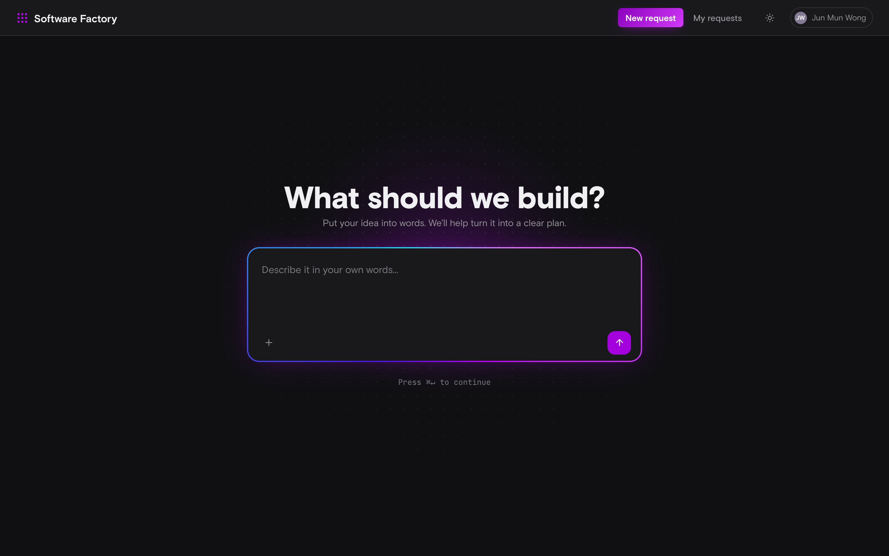
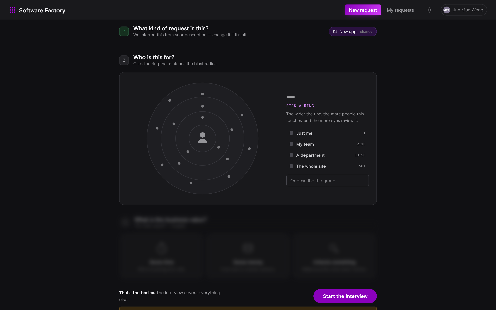
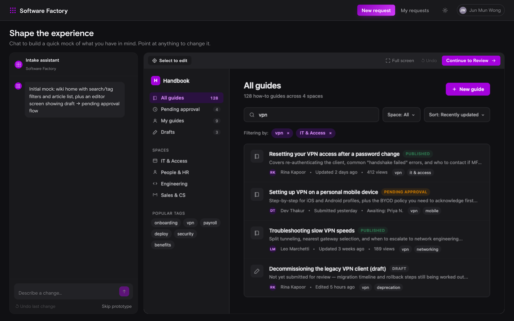
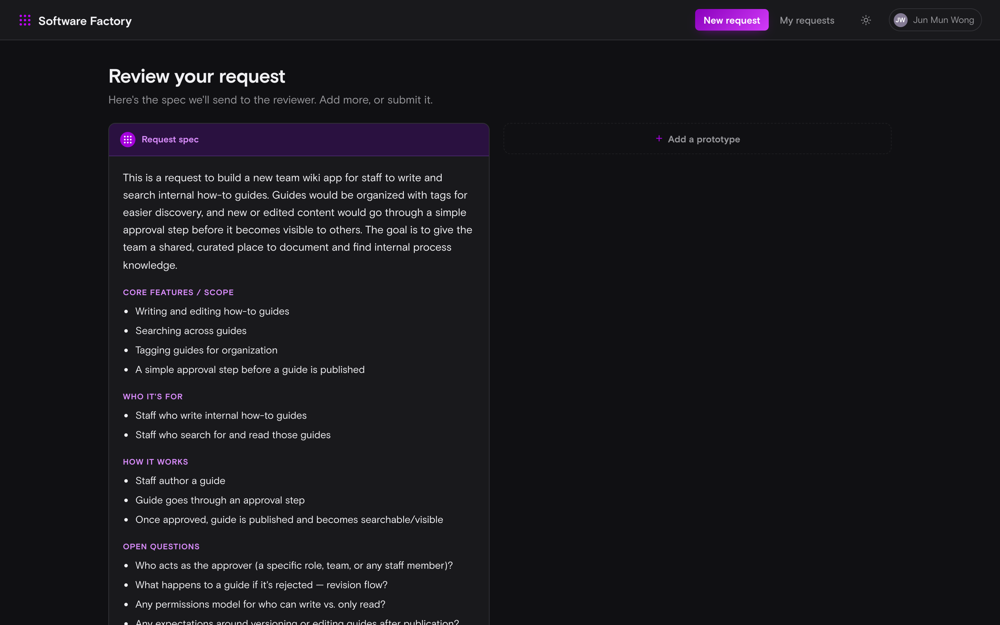
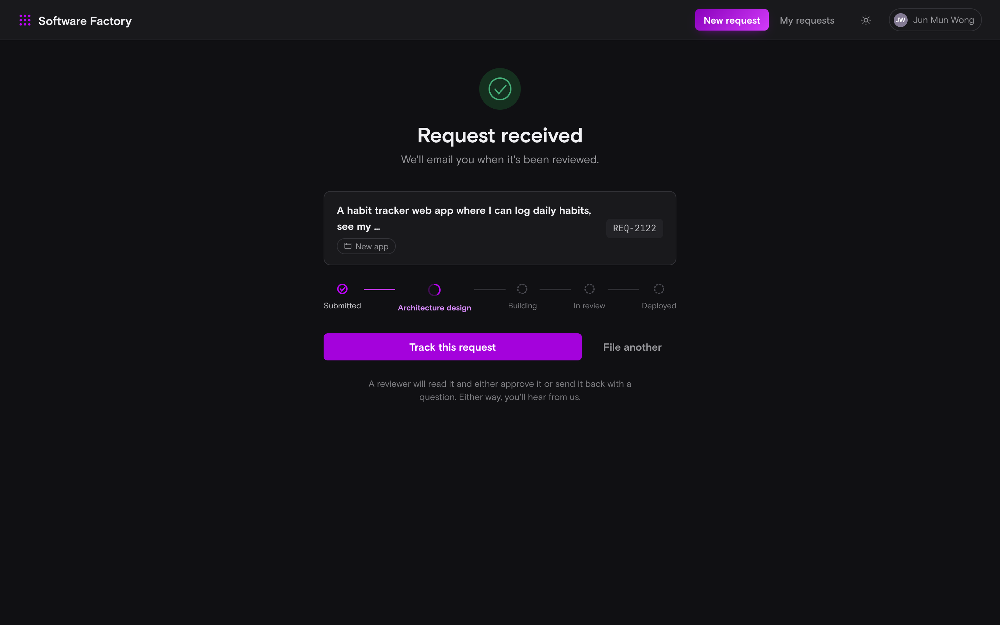
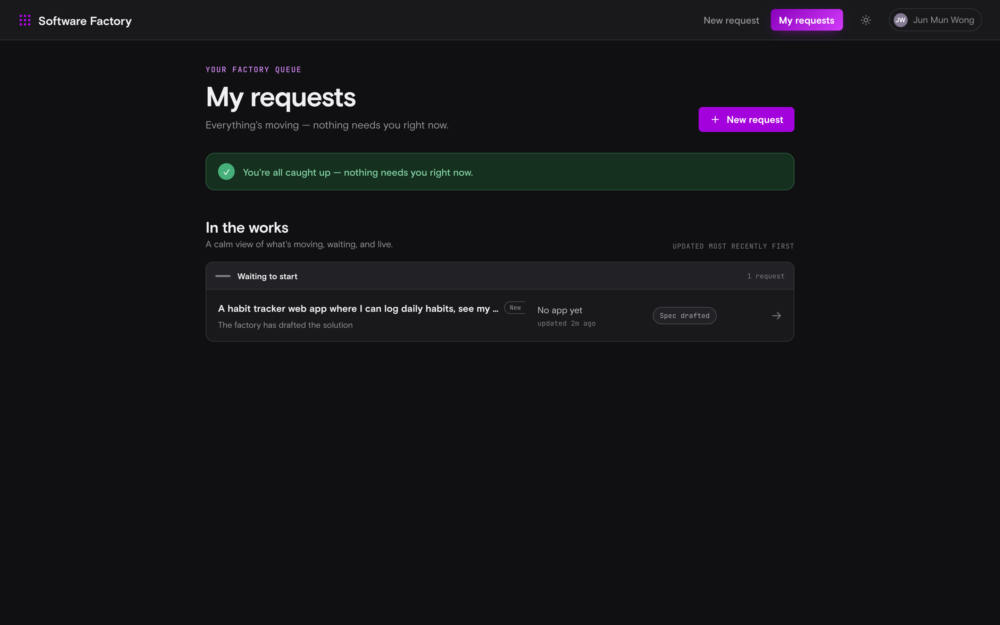
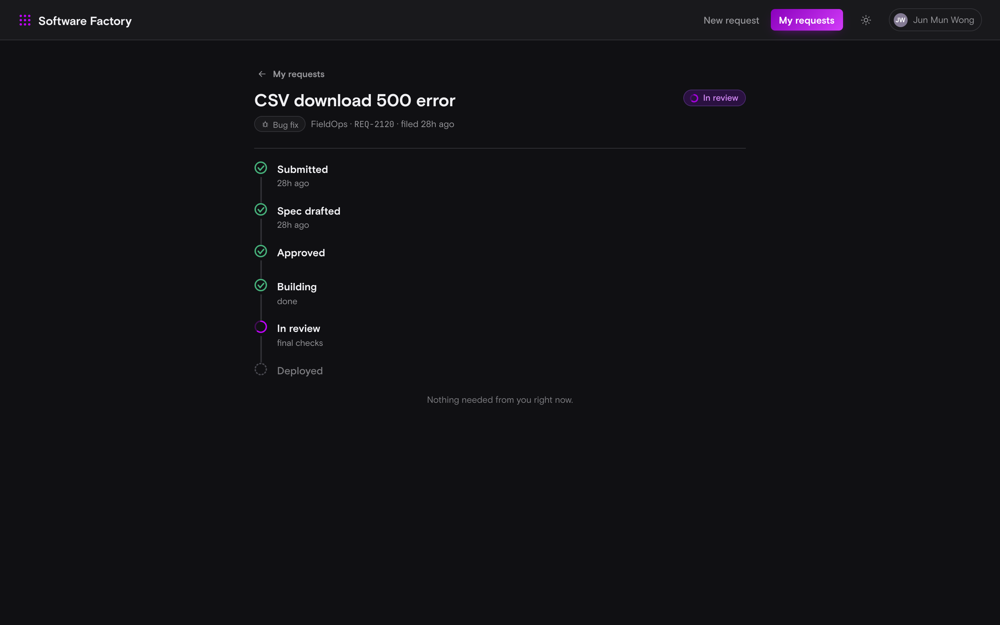

# Intake app — screen captures

Screenshots of every screen in the **Intake** (submitter) app, captured at
1440×900 (dark theme) against local seed data on 2026-07-14.

| # | Screen | Route | What it is |
|---|--------|-------|------------|
| 1 | New Request | `/submit/new` | The describe hero — one composer to put the idea into words. |
| 2 | Clarify / Interview | `/submit/:id/interview` | Confirms the request type + blast radius, then starts the interview. |
| 3 | Prototype | `/submit/:id/prototype` | Chat-driven live mock of the idea; point at anything to change it. |
| 4 | Review | `/submit/:id/review` | The generated spec that goes to the reviewer. |
| 5 | Confirmation | `/submit/:id/done` | Request received, with the pipeline progress stepper. |
| 6 | My Requests | `/requests` | The submitter's inbox — what's moving, waiting, and live. |
| 7 | Request detail | `/requests/:id` | A single request's status timeline. |

### 1 — New Request

### 2 — Clarify / Interview

### 3 — Prototype

### 4 — Review

### 5 — Confirmation

### 6 — My Requests

### 7 — Request detail

